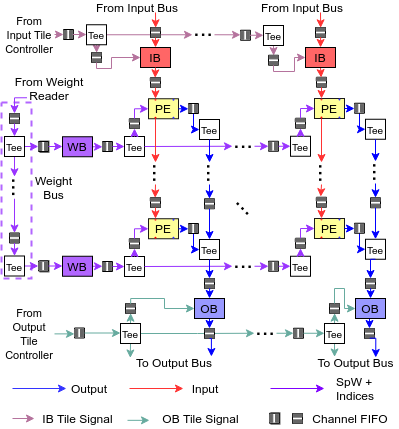
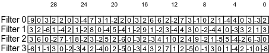
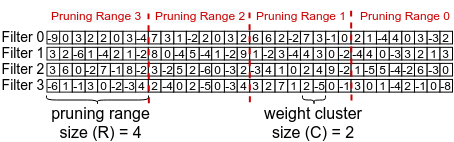
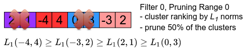
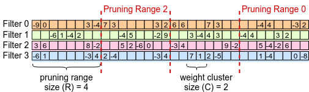
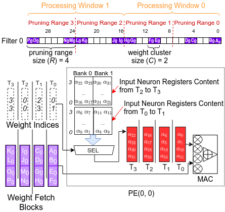
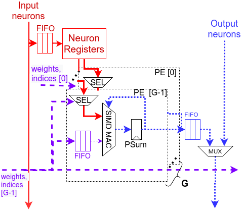

## Design of the Sparse CNN Inference Accelerator
### Overview of the Accelerator

The accelerator is made of OpenCL kernels connected by *channels*, which are FIFO-like features supported by Intel FPGA SDK for OpenCL. The modules are grouped into blocks according to their functionalities, and we briefly describe the blocks below:

- **Convolution Engine (CONV Engine)** processes convolutional (CONV) and fully-connected layers (FC). 
- **Miscellaneous Engine (MISC Engine)** processes max-pooling, average-pooling, concatenation, and element-wse addition layers.
- **Input Tile Controller (ITC)** and **Output Tile Controller (OTC)** control data access of buffers inside the CONV engine.
- **MISC Tile Controller (MTC)** guides the MISC engine to perform operations in a tile-by-tile fashion.
- **Input Reader, Weight Reader, and Output Writer** move data (weights, neurons) between the accelerator and the off-chip memory (DRAM).

All OpenCL kernels are implemented in [accelerator/device/sparse_pe_system.cl](../accelerator/device/sparse_pe_system.cl)

A CPU-host is responsible for converting a given CNN into instructions for the accelerator blocks, and transfer the instructions as well as weights/biases to the accelerator before making any inference call. All instructions and weights are stored on the off-chip DRAM. At the start of each inference call, the host transfers the input neurons to the off-chip DRAM. For the execution of each layer, the host directs the accelerator to access instructions from the off-chip DRAM. Although the accelerator leverages data-reuse opportunity within each layer by buffering data on the on-chip memory, the intermediate results that proceed from each layer are buffered in the off-chip DRAM. At the end of each inference call, the host transfers the results from the off-chip DRAM to the host-side.

### The Convolution Engine

The convolution engine consists of a systolic-array of processing elements (PEs), weight buffers, input neuron buffers, and output neuron buffers. Weights and input neurons are propagated along the rows and columns, respectively. The topology is inspired by the work of Wei et al. [2]. Each PE performs MAC operations between weights and input neurons in a SIMD fashion. MAC operation results are shifted out of the systolic-array along the columns into the output neuron buffers, where ReLU activation function is applied.  

The buffers are implemented as ping-pong buffers to overlap data access from off-chip DRAM with transfers to and from the systolic array.

Since the size of input and output neuron tensors are large in typicial convolutional and fully-connected layers, tiling is used to breakdown the tensors. Please refer to the author's thesis (will be made available by November 2021) for details. 
### Micro-range Clustered Bank-Balanced Sparsity
There are two challenges that we need to address in order to reap gains from weight sparsity.

1. Gathering the right input neurons to the sparse weights at the right cycles. This is trivial if both weights and neurons are dense. However, in the presence of weight sparsity, crossbars are required for selecting the right input neurons to be multiplied with the weights. The fewer the constraints on the pattern of weight sparsity, the more complex the crossbars are.

2. Balancing the workload across several rows of PE. Without any constraint, some PE rows might see more sparse weights than the rest, and the overall latency of the systolic array is limited by the slowest-moving rows.

We propose a fine-grained constraint on the sparsity pattern, Micro-range Clustered Bank-Balanced Sparsity (MCBBS), to address these issues. MCBBS is inspired by Bank-Balanced Sparsity [3], which is proposed for a 1D systolic array accelerator for long short-term memories (LSTMs).

Below is a toy example on how MCBBS is enforced on 4 1x1 filters. Note that other filter sizes are actually more common, but we choose 1x1 for simplicity.

1. The filters before pruning:

 

2. Grouping adjacent weights into clusters, and grouping consecutive clusters into pruning ranges:

3. Rank the clusters in each pruning range according to their L1 norms, and prune the least significant clusters. All the prunings ranges of filtes from the same layer are pruned with the same sparsity level.

4. After pruning, all filters retain the same number of sparse weights. Morever, the matching input neuron of each sparse weight is guaranteed to reside in a relative small window that has the same size as a pruning range.

Generally, MCBBS is parametrized by the following values:

- C: The size of each cluster in terms of the number of weights.
- R: The size of each pruning range in terms of the number of clusters.

The purpose of clustering is to allow consecutive sparse weights to share indices, which are used by the PEs to select the right input neurons for multiplication with the weights. On the other hand, pruning ranges narrows the selection window of input neurons for each sparse weight.

### Supporting MCBBS in PEs
To support MCBBS in each systolic array PE, we introduce neuron registers to buffer input neurons and multiplexer to select neurons that should be multiplied with incoming sparse weights. The SIMD MAC operations in each PE is spread over several consecutive pruning ranges, which form a *processing window*. The number of multipliers inside a PE is the product between the cluster size and the processing window size: C \* P. Sparse weights arrive at each PE as weight fetch blocks. Each weight fetch blocks is made of interleaving weight clusters from pruning ranges inside the same processing window. We also assign an index to each weight cluster. The value of the index is the position of the cluster inside its pruning range. The PE uses weight indices as selection signals for the neuron multiplexer. The neuron registers buffer all the input neurons that span over one processing window, an they are updated as weights from a new processing window arrives. The following figure shows a PE performing MAC operations between a sparse filter and dense neuron from the convolution window:

### Optimization: Coalescing Adjacent PEs in the same Systolic Array Column
Since PEs in the same systolic array column see the same input neurons, and all take the same number of cycles to processing filters that pass through them, we can coalescing adjacent PEs in the same systolic array column. This enables the PEs to share neuron registers, neuron FIFO connections, and control logic across the coalesced PEs, leading to FPGA resource saving. The number of PEs that are packed to the same group is denoted as *G*. 

